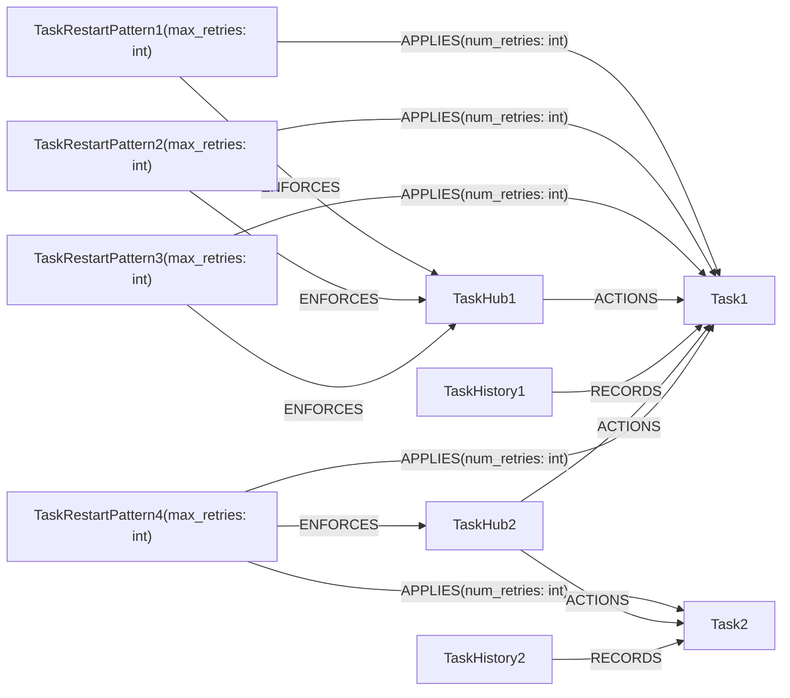

## Introduction

Since tasks are run on a variety of compute resources, many modes of failure can be anticipated by a user and some of these modes simply require that the task is resubmitted.
Especially in the context of living networks and automated strategies, the need to manually restart tasks is needlessly cumbersome.
These concerns were originally raised by Jenke Scheen and [an issue][issue] was created.
Here I propose an architecture which automates restarting tasks.


## User requirements and expectations

A "task restart policy" refers to a collection of `TaskRestartPattern` objects which, when compared to tracebacks returned from a `ComputeService`, are used to determine when a `Task` in an `error` state should be restarted or de-actioned entirely.

`TaskRestartPatterns` are associated with a single `TaskHub` and contain a single regular expression string used for matching.
Creation, deletion, and modification of these `TaskRestartPattern`s is exposed through the following new `AlchemiscaleClient` methods:

1. `add_task_restart_patterns(an_sk: ScopedKey, patterns: List[str], num_allowed_restarts: int) -> ScopedKey`

Given a **list** of regex patterns as strings, an `AlchemicalNetwork`'s `ScopedKey`, and a number of allowed restarts, this method creates and connects the needed `TaskRestartPattern`s to the `AlchemicalNetwork`'s `TaskHub`.

2. `get_task_restart_patterns(an_sk: ScopedKey) -> Dict[str, int]`

Given an `AlchemicalNetwork`'s `ScopedKey`, retrieve a dictionary all of the string regular expression patterns that enforce the task restart policy for that network along with their respective allowed number of restarts as a value.

3. `set_task_restart_patterns_allow_restarts(an_sk: ScopedKey, patterns: List[str], num_allowed_restarts: Union[int, List[int]])`

Given an `AlchemicalNetwork`'s `ScopedKey`, set the number of restarts allowed by the patterns specified in a `list`.
The number of restarts can be specified with a single integer value or a list of integers of the same length as the number of patterns.

4. `remove_task_restart_patterns(an_sk: ScopedKey, patterns: List[str])`

Given an `AlchemicalNetwork`'s `ScopedKey` and a list of regular expression patterns, remove those patterns from the `AlchemicalNetwork`'s task restart policy.

5. `clear_task_restart_patterns(an_sk: ScopedKey)`

Given an `AlchemicalNetwork`'s `ScopedKey`, remove all patterns that enforce the task restart policy for that `AlchemicalNetwork`.


### Example usage

For instance the code block,

```python
add_task_restart_patterns(scoped_key, ["string1", "string2", "string3"], 5)
add_task_restart_patterns(scoped_key, ["string1", "string4", "string5"], 3)
```

would result in the following set of patterns(as reported by `get_task_restart_patterns`, likely in a different order):

```
{
"string1": 3,
"string2": 5,
"string3": 5,
"string4": 3,
"string5": 3,
}
```

Note that since `string1` appeared in both calls, the assigned allowed number of errors is set to the latest value.
Along the same line, restart policy patterns can be removed with:

```python
remove_patterns = ["string2", "string3"]
remove_task_restart_policy_patterns(scoped_key, remove_patterns)
```

## Internal database representation

This feature introduces a couple of new data representations into the Neo4j database:

1. `TaskRestartPatterns`
2. `TaskHistory`

`TaskRestartPatterns`s attach directly to a `TaskHub` with the `ENFORCES` relationship as well as all `Task`s `ACTIONED` by that `TaskHub`.
This node only contains the policy strings and their number of allowed restarts.
The `APPLIES` relationship between the `TaskRestartPattern`'s and the individual `Task`s keeps track of the number of times the `Task` has been restarted since it was last `ACTIONED` on the `TaskHub`.

In order to make decisions on whether to de-action a `Task` or set it back to waiting, efficient retrieval of the latest `Task` error traceback is needed.
Instead of only storing this information in the `Task`'s `ProtocolDAGResult`, we use a `TaskHistory` node to hold a copy of **all** tracebacks that the `Task` has every returned after an error, making it an append-only data structure.
When a `ComputeService` sends back data from a failed `Task`, the traceback of the error is added to the `TaskHistory` and the status of the `Task` is then set to `error`.

Below is an example of two `Task`s `ACTIONED` on two `TaskHub`s, each with their own `TaskRestartPattern`s.




### `TaskRestartPattern` and its relationships with other nodes

Since most of the heavy lifting is handled by the presence/absence of the `APPLIES` relationship between a `Task` and a `TaskRestartPattern`, it's important to establish when the relationship needs to be created or deleted.
Each `TaskRestartPattern` has one `ENFORCES` relationship with a `TaskHub` and one or more `APPLIES` relationships with `Task`s `ACTIONED` by the aforementioned `TaskHub`.

When adding a new `TaskRestartPattern`, each of the `Task`s that have previously been actioned must have the `APPLIES` relationship added to them along with the `ENFORCES` relationship with the `TaskHub`.
The reverse operation of this is deleting the `TaskRestartPattern`, which automatically deletes all of the relevant relationships and is thus a complete operation.
On the other hand, when **actioning** (as opposed to creating) a `Task` where `TaskRestartPattern`s are already enforcing a `TaskHub`, the `APPLIES` relationship needs to be added to all of those `TaskRestartPattern`s and the new task.
When de-actioning a `Task`, all `APPLIES` relationships must be removed from that `Task` given the `TaskHub`.
In all cases where an `APPLIES` relationship is created between a `TaskRestartPattern` and a `Task` the `num_retries` value is always set to zero as it should reflect the number of retries since the last time the `Task` was actioned.


Changing the status of a `Task` from "error" to anything other than "waiting" also requires that the `APPLIES` relationship is deleted.



## Execution of restarts

Like the rest of the `alchemiscale` architecture, the restarting of `Task`s will be handled by a dedicated `TaskRestartService`.
The only purpose of this service is to periodically nudge the API server to run the `alchemiscale.storage.statestore.Neo4jStore.tasks_resolve_restarts` method.
During the execution of this method, all pairs of `TaskRestartPattern` and the `Task`s that they have an `APPLIES` relationship with are collected and grouped according to their `TaskHub`s.
This is further grouped on each `Task`.
Taking the image above, the initial query will return:

```
(TaskRestartPattern1, TaskHub1, Task1, TaskHistory1)
(TaskRestartPattern2, TaskHub1, Task1, TaskHistory1)
(TaskRestartPattern3, TaskHub1, Task1, TaskHistory1)
(TaskRestartPattern4, TaskHub2, Task1, TaskHistory1)
(TaskRestartPattern4, TaskHub2, Task2, TaskHistory2)
```

which is then grouped into

```
TaskHub1:
  (TaskRestartPattern1, Task1, TaskHistory1)
  (TaskRestartPattern2, Task1, TaskHistory1)
  (TaskRestartPattern3, Task1, TaskHistory1)

TaskHub2:
  (TaskRestartPattern4, Task1, TaskHistory1)
  (TaskRestartPattern4, Task2, TaskHistory2)
```

which is further refined into

```
TaskHub1:
  Task1:
    (TaskRestartPattern1, TaskHistory1)
    (TaskRestartPattern2, TaskHistory1)
    (TaskRestartPattern3, TaskHistory1)

TaskHub2:
  Task1:
    (TaskRestartPattern4, TaskHistory1)
  Task2:
    (TaskRestartPattern4, TaskHistory2)
```

For each of these groups, all of the patterns are compared to the last entry in the `TaskHistory`'s log.
Those that do not match are filtered out.
Of the remaining matches, the `num_retries` value contained in the `APPLIES` relationship is incremented and compared to the `max_retries` value in it corresponding `TaskRestartPattern` node.
If any of these `num_retries` are larger than or equal to the `max_retries` (or there are no matches at all), the `Task` is de-actioned from the corresponding `TaskHub`, which also removes the `APPLIES` relationships between that `Task` and the `TaskHub`s associated `TaskRestartPattern`s.
If all `num_retries` are less than the `max_retries`, the `Task` status will be switched to "waiting" once all other `TaskHub`s have been looped over and potentially de-actioned.


[issue]: https://github.com/openforcefield/alchemiscale/issues/277
